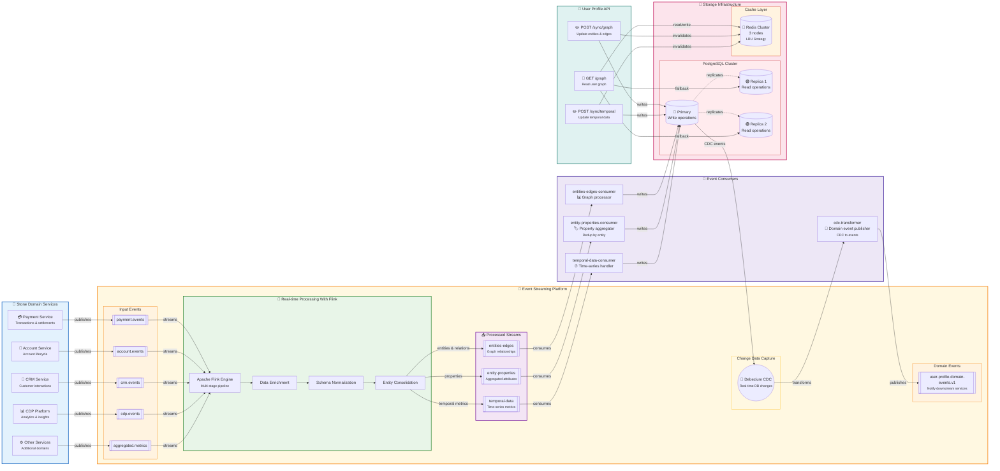
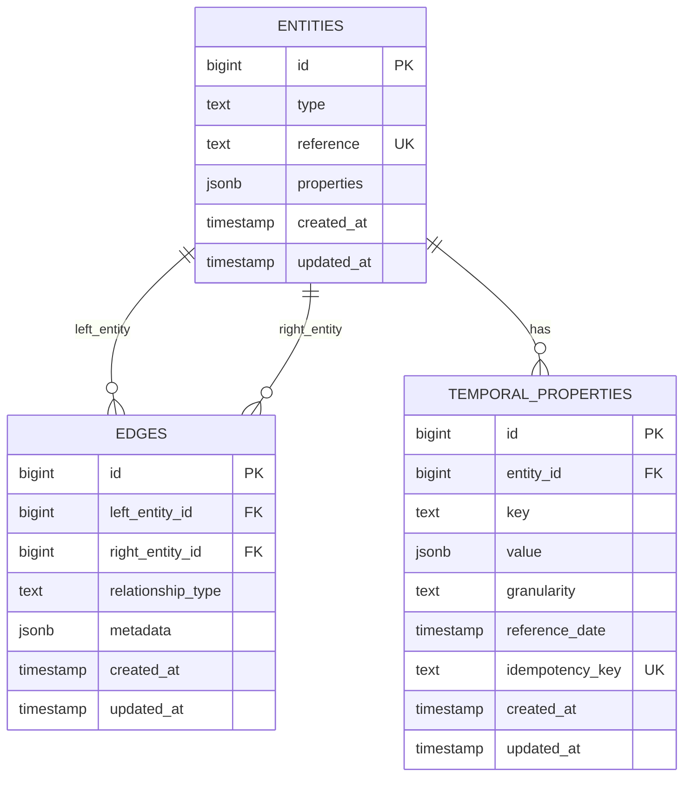
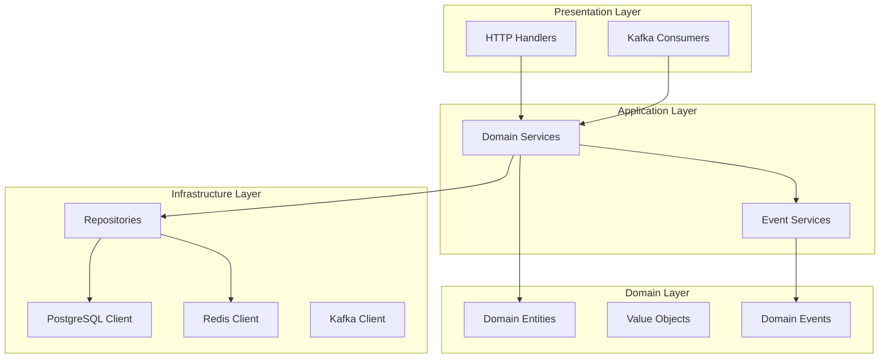

# User Profile POC

> **Uma Proof of Concept para centralização e processamento de dados de perfil de usuário em tempo real com arquitetura event-driven.**

## 📋 Table of Contents

- [🎯 Visão Geral & Problema (Contexto e motivação)](#-visão-geral--problema)
- [🛠️ Stack Tecnológica (Com quais ferramentas foi feito)](#️-stack-tecnológica)
- [🏗️ Arquitetura & Design (Visão macro do sistema)](#️-arquitetura--design)
- [📁 Arquitetura de Código (Implementação pratica)](#-arquitetura-de-código)
- [💾 Write Repositories (Como os dados entram)](#-write-repositories)
- [📖 Read Repositories (Como os dados saem)](#-read-repositories)
- [⚙️ Workers (Como os dados sao processados)](#️-workers)
- [🌐 API Endpoints (Intefaces do sistema)](#-api-endpoints)
- [🚀 Setup & Operação (Como usar)](#-setup--operação)
- [📊 Testes de Carga (Como testar)](#-testes-de-carga)


## 🎯 Visão Geral & Problema

### **Desafio**
Organizações modernas enfrentam o desafio de **dados de usuário fragmentados** espalhados por múltiplos sistemas:
- Dados pontuais (perfil, preferências, configurações)
- Dados temporais (métricas, KPIs, analytics)
- Relacionamentos complexos entre entidades
- Necessidade de consultas em tempo real com baixa latência

### **Solução**
Uma **API User Profile centralizada** que:
- 🎯 **Centraliza** dados de perfil em um modelo de grafo flexível
- ⚡ **Processa** eventos em tempo real via Kafka
- 🔄 **Publica** domain events via CDC (Change Data Capture)
- 📊 **Otimiza** consultas com cache Redis e read replicas
- 🏗️ **Escala** horizontalmente com arquitetura event-driven

### **Benefícios**
- **Performance**: Cache Redis + Read Replicas PostgreSQL
- **Escalabilidade**: Processamento assíncrono via Kafka
- **Flexibilidade**: Modelo de dados JSON + grafo dinâmico
- **Observabilidade**: Domain events para auditoria e analytics
- **Consistência**: CDC garante sincronização automática


## 🛠️ Stack Tecnológica

### **Backend & Runtime**
- **Go 1.24.4**: Performance + concorrência nativa
- **Gin Framework**: HTTP router rápido e minimalista
- **pgx/v5**: Driver PostgreSQL otimizado para Go
- **go-redis/v9**: Cliente Redis com cluster support

### **Storage & Cache**
- **PostgreSQL 16**: Banco relacional com suporte a JSON
- **Redis 7**: Cache distribuído em cluster
- **Replicação**: 1 primary + 2 read replicas para escalabilidade

### **Stream Processing & Integration**
- **Apache Flink**: Stream processing para normalização de dados
- **Flink SQL**: Transformações declarativas de eventos

### **Messaging & Events**
- **Apache Kafka**: Message broker distribuído
- **Debezium**: CDC platform para PostgreSQL
- **Kafka Connect**: Conectores para integração

### **Infrastructure**
- **Docker Compose**: Orquestração local
- **Make**: Automação de comandos
- **K6**: Testes de carga e performance

### **Justificativas Técnicas**

| Tecnologia | Por que escolhemos |
|------------|-------------------|
| **Apache Flink** | Stream processing nativo, SQL declarativo, conectores robustos |
| **Go** | Performance superior, concorrência nativa, binary único |
| **PostgreSQL** | ACID compliance, JSON nativo, replicação robusta |
| **Redis** | Cache sub-milissegundo, estruturas de dados avançadas |
| **Kafka** | Throughput alto, durabilidade, processamento de streams |
| **Debezium** | CDC sem impacto na aplicação, garantia de entrega |

### **Benefícios da Integração via Flink**

| Benefício | Descrição |
|-----------|-----------|
| **Padronização** | Unifica schemas heterogêneos em contratos consistentes |
| **Escalabilidade** | Processa milhões de eventos por segundo |
| **Flexibilidade** | SQL declarativo para transformações complexas |
| **Tolerância a Falhas** | Checkpointing e recovery automático |
| **Baixa Latência** | Stream processing com latência sub-segundo |
| **Evolução de Schema** | Permite mudanças nos sistemas upstream sem impacto |


## 🏗️ Arquitetura & Design

### **Visão Geral da Arquitetura**



### **Componentes Principais**

| Camada | Componente | Responsabilidade | Tecnologia |
|--------|------------|------------------|------------|
| **Integration** | **Apache Flink** | Stream processing e normalização de dados | Apache Flink |
| **Application** | **User Profile API** | Interface HTTP para consultas | Go + Gin |
| **Storage** | **PostgreSQL Cluster** | Armazenamento principal (1 primary + 2 replicas) | PostgreSQL 16 |
| **Cache** | **Redis Cluster** | Cache distribuído para consultas | Redis 7 |
| **Messaging** | **Kafka** | Message broker para eventos | Apache Kafka |
| **CDC** | **Debezium CDC** | Change Data Capture | Debezium + Kafka Connect |
| **Processing** | **Consumers** | Processamento assíncrono de eventos | Go workers |

### **Camada de Integração - Apache Flink**

A arquitetura utiliza **Apache Flink** como camada de integração para resolver o desafio de **múltiplos formatos de dados** de diferentes domínios:

#### **Desafio:**
- Centenas de microserviços com eventos em formatos diferentes
- Payloads heterogêneos (JSON schemas variados)
- Necessidade de evitar milhares de conectores específicos
- Dados vindos de CDP, agregações e outras fontes externas

#### **Transformações Típicas:**

**Origem X → User Profile Entities e Edges**
```sql
CREATE TABLE `flink.agg.user-profile.entities` (
  id                      STRING NOT NULL,
  reference               STRING NOT NULL,
  `type`                  STRING NOT NULL,
  edges                   ARRAY<STRING> NOT NULL,
  
  PRIMARY KEY (id) NOT NULL
) 
AS
SELECT
```

**Origem Y → User Profile Properties**
```sql
CREATE TABLE `flink.agg.user-profile.entities.properties` (
  entity_id STRING NOT NULL,
  type      STRING NOT NULL,
  value     STRING NOT NULL,
  
  PRIMARY KEY (entity_id, type) NOT NULL
)
AS
SELECT
```

**Origem Z → Temporal Data:**
```sql
CREATE TABLE `flink.agg.user-profile.entities.temporal-properties` (
  entity_id        STRING NOT NULL,
  type             STRING NOT NULL,
  value            STRING NOT NULL,
  period_reference TIMESTAMP NOT NULL,
  granularity      STRING NOT NULL,
  ts               TIMESTAMP_TZ(3) NOT NULL
  
  PRIMARY KEY (entity_id, type, period_reference) NOT NULL
)
```

### **Padrões Arquiteturais**

- **Repository Pattern**: Abstração de acesso a dados
- **CDC (Change Data Capture)**: Captura automática de mudanças
- **Event Sourcing**: Rastreamento de todas as mudanças
- **CQRS**: Separação de leitura (replicas + cache) e escrita
- **Domain Events**: Eventos de negócio para integração

### **Modelo de Dados**



## 📁 Arquitetura de Código

### **Estrutura de Pastas**

```
src/
├── adapters/           # Camada de adaptadores
│   ├── http/          # HTTP handlers e DTOs
│   └── kafka/         # Kafka consumers
├── cmd/               # Entry points da aplicação
│   ├── server/        # HTTP API server
│   ├── cdc-transformer/ # CDC consumer
│   └── *-consumer/    # Kafka consumers
├── domain/            # Camada de domínio
│   ├── entities/      # Entidades de negócio
│   └── value_objects.go # VOs e eventos
├── infra/             # Camada de infraestrutura
│   ├── postgres/      # Cliente PostgreSQL
│   ├── redis/         # Cliente Redis
│   ├── kafka/         # Cliente Kafka
│   └── debezium/      # Cliente Debezium CDC
├── repositories/      # Repositórios de dados
├── services/          # Serviços de domínio
│   └── events/        # Event handlers
└── helper/            # Utilitários
```

### **Camadas Arquiteturais**



### **Dependency Injection (Uber FX)**

```go
func main() {
    app := fx.New(
        // Infrastructure providers
        fx.Provide(
            newLogger,
            newPostgreSQLClient,
            newRedisClient,
            newKafkaClient,
        ),

        // Repository providers
        fx.Provide(
            newGraphQueryRepository,
            newCachedGraphRepository,
            newGraphWriteRepository,
        ),

        // Service providers
        fx.Provide(
            newGraphService,
            newTemporalDataService,
        ),

        // Server provider
        fx.Provide(newHTTPServer),

        // Lifecycle hooks
        fx.Invoke(registerServerHooks),
    )

    app.Run()
}
```

## 💾 Write Repositories

### **1. Estratégia de Escrita**

A estratégia de escrita dos repositórios é baseada em **três pilares fundamentais** que garantem alta performance e consistência:

#### **Tabela Temporária em Memória (Staging Area)**
Em cada transação, criamos uma **tabela temporária** que serve como área de staging para todos os dados que precisamos inserir ou atualizar em diferentes tabelas:

```go
// Tabela temporária unificada para processar entidades e relacionamentos
tempTableQuery := `CREATE TEMP TABLE temp_sync_data (
    entity_type TEXT, entity_reference TEXT, entity_properties JSONB,
    source_reference TEXT, target_reference TEXT, relationship_type TEXT
) ON COMMIT DROP;`
```

Esta abordagem permite:
- **Unificação de dados**: Uma única estrutura para entities + relationships
- **Atomic processing**: Todos os dados ficam na mesma transação
- **Memory efficiency**: Tabela temporária existe apenas na RAM

#### **COPY FROM para Transfer Performático**
Utilizamos `COPY FROM` para transferir os dados de forma otimizada para o PostgreSQL:

```go
// Bulk transfer via COPY FROM (stream de dados)
_, err = tx.CopyFrom(ctx, pgx.Identifier{"temp_sync_data"}, columns, pgx.CopyFromRows(rows))
```

**Por que COPY FROM?**
- **~5-10x mais rápido** que INSERT em batch
- **Stream de dados**: Não carrega tudo na RAM do cliente
- **Integração nativa** com transações PostgreSQL

#### **CTE Única para Processamento Atômico**
Após o COPY FROM, executamos uma única **mega-query CTE** que faz todo o trabalho:

1. **Upsert Entities**: Insere/atualiza entidades com smart updates
2. **Collect References**: Coleta todas as referências (entities + relationships)
3. **Map Entity IDs**: Resolve referências de negócio → IDs internos
4. **Upsert Relationships**: Cria/atualiza relacionamentos
5. **Return Affected IDs**: Retorna IDs das entidades que tiveram mudança real

Esta CTE utiliza `ON CONFLICT DO UPDATE WHERE IS DISTINCT FROM` para garantir que **apenas mudanças reais** resultem em I/O de disco.

#### **Smart Cache Invalidation**
Com os IDs retornados pela CTE, solicitamos a invalidação seletiva do cache Redis:

```go
// Invalida apenas entidades que tiveram mudança real
go func() {
    r.cachedGraphRepository.InvalidateByEntityIDs(ctx, affectedIDs)
}()
```

Isso permite que dados sejam **cacheados por muito tempo** (TTL alto), evitando leituras de disco nas operações de consulta.

### **2. Benefícios da Estratégia**

#### **COPY FROM vs INSERT em Batch**

| Vantagem | COPY FROM | INSERT em Batch |
|----------|-----------|-----------------|
| **Performance** | ~5-10x mais rápido | Baseline (100%) |
| **Memory usage** | Stream (constante) | Carrega batch inteiro na RAM |
| **Tuple size limit** | Sem limitação | Limitado pelo tamanho da tupla |
| **Multi-table support** | Via tabela temporária | Restrito a 1 tabela por operação |
| **Error handling** | Falha total ou sucesso | Pode falhar parcialmente |
| **Protocol efficiency** | Protocolo binário otimizado | SQL parsing + planning overhead |

#### **CTE Única vs Múltiplas Queries**

| Aspecto | Múltiplas Queries | CTE Única |
|---------|-------------------|-----------|
| **Round-trips de rede** | 5-10 queries separadas | 1 única query |
| **Consistency** | Race conditions possíveis | Atomicidade garantida |
| **Error handling** | Falha parcial complexa | Falha total ou sucesso |
| **Transaction overhead** | Alto (múltiplas operações) | Baixo (operação única) |

#### **I/O Optimization (Smart Updates)**

Utilizamos o padrão `WHERE IS DISTINCT FROM` que faz com que o PostgreSQL **não execute I/O de disco** quando não há mudança real:

```sql
ON CONFLICT (reference, type) DO UPDATE SET
  properties = excluded.properties,
  updated_at = NOW()
WHERE entities.properties IS DISTINCT FROM excluded.properties
```

#### **Cenários de Otimização de I/O**

| Cenário | Exemplo | Resultado |
|---------|---------|-----------|
| **Batch totalmente duplicado** | 1000 msgs, 0 mudanças reais | **0 disk writes** |
| **Partial changes** | 1000 msgs, 50 mudanças reais | **50 disk writes** |
| **New entities only** | 1000 msgs, 1000 entities novas | **1000 inserts** |
| **Property merge identical** | Merge `{a:1}` + `{a:1}` | **0 disk writes** |
| **Property merge different** | Merge `{a:1}` + `{a:2}` | **1 disk write** |

#### **Cache Strategy Benefits**

| Vantagem | Implementação | Resultado |
|----------|---------------|-----------|
| **Selective invalidation** | Apenas IDs realmente afetados | Cache hit rate mantido |
| **Background processing** | Invalidação assíncrona | Latência baixa para writes |
| **High TTL viability** | Smart updates + invalidation | Menor carga no banco |

### **3. Repositórios**

#### **Graph Repository (Entities + Edges)**

O repositório de grafo processa entidades e relacionamentos em uma única operação:

**Passo 1: Criar tabela temporária e COPY FROM**
```sql
-- Tabela temporária para staging
CREATE TEMP TABLE temp_sync_data (
    entity_type TEXT, entity_reference TEXT, entity_properties JSONB,
    source_reference TEXT, target_reference TEXT, relationship_type TEXT
) ON COMMIT DROP;

-- COPY FROM via pgx (stream de dados)
```

**Passo 2: CTE unificada para upsert atômico**
```sql
WITH
-- CTE 1: Upsert entities com smart update
entities_upsert AS (
    INSERT INTO entities (type, reference, properties)
    SELECT DISTINCT entity_type, entity_reference, entity_properties
    FROM temp_sync_data
    WHERE entity_reference IS NOT NULL
    ON CONFLICT (type, reference) DO UPDATE SET
        properties = COALESCE(entities.properties, '{}'::jsonb) || excluded.properties,
        updated_at = NOW()
    WHERE COALESCE(entities.properties, '{}'::jsonb) || excluded.properties
          IS DISTINCT FROM entities.properties
    RETURNING id, reference, type
),

-- CTE 2: Coletar todas as referências necessárias
all_references AS (
    SELECT DISTINCT entity_reference as reference, entity_type as type FROM temp_sync_data WHERE entity_reference IS NOT NULL
    UNION
    SELECT DISTINCT source_reference as reference, 'user' as type FROM temp_sync_data WHERE source_reference IS NOT NULL
    UNION
    SELECT DISTINCT target_reference as reference, 'unknown' as type FROM temp_sync_data WHERE target_reference IS NOT NULL
),

-- CTE 3: Mapear references → IDs internos
entity_mapping AS (
    SELECT e.id, e.reference, e.type
    FROM entities e
    INNER JOIN all_references ar ON e.reference = ar.reference AND e.type = ar.type
    UNION ALL
    SELECT eu.id, eu.reference, eu.type FROM entities_upsert eu
),

-- CTE 4: Upsert relationships
edges_upsert AS (
    INSERT INTO edges (left_entity_id, right_entity_id, relationship_type)
    SELECT DISTINCT
        source_map.id,
        target_map.id,
        temp.relationship_type
    FROM temp_sync_data temp
    INNER JOIN entity_mapping source_map ON source_map.reference = temp.source_reference
    INNER JOIN entity_mapping target_map ON target_map.reference = temp.target_reference
    WHERE temp.relationship_type IS NOT NULL
    ON CONFLICT (left_entity_id, right_entity_id, relationship_type) DO UPDATE SET
        updated_at = NOW()
    WHERE edges.updated_at IS DISTINCT FROM excluded.updated_at
    RETURNING left_entity_id as entity_id
)

-- Retorna IDs afetados para cache invalidation
SELECT DISTINCT id as affected_entity_id FROM entities_upsert
UNION
SELECT DISTINCT entity_id as affected_entity_id FROM edges_upsert;
```

#### **Temporal Data Repository**

O repositório de dados temporais foca em métricas e time-series:

**Passo 1: Criar tabela temporária específica**
```sql
CREATE TEMP TABLE temp_temporal_data (
    entity_reference TEXT, entity_type TEXT,
    property_key TEXT, property_value JSONB,
    granularity TEXT, reference_date TIMESTAMP,
    idempotency_key TEXT
) ON COMMIT DROP;
```

**Passo 2: CTE para temporal upsert**
```sql
WITH
-- CTE 1: Resolver entity references → IDs
entity_resolution AS (
    SELECT DISTINCT
        e.id as entity_id,
        ttd.property_key,
        ttd.property_value,
        ttd.granularity,
        ttd.reference_date,
        ttd.idempotency_key
    FROM temp_temporal_data ttd
    INNER JOIN entities e ON e.reference = ttd.entity_reference AND e.type = ttd.entity_type
),

-- CTE 2: Upsert temporal properties com deduplicação
temporal_upsert AS (
    INSERT INTO temporal_properties (entity_id, key, value, granularity, reference_date, idempotency_key)
    SELECT DISTINCT ON (entity_id, key, granularity, reference_date)
        entity_id, property_key, property_value, granularity, reference_date, idempotency_key
    FROM entity_resolution
    ORDER BY entity_id, key, granularity, reference_date, reference_date DESC -- newest wins em caso de conflito
    ON CONFLICT (idempotency_key) DO UPDATE SET
        value = excluded.value,
        updated_at = NOW()
    WHERE temporal_properties.value IS DISTINCT FROM excluded.value
    RETURNING entity_id
)

-- Retorna entity IDs afetados para cache invalidation
SELECT DISTINCT entity_id as affected_entity_id FROM temporal_upsert;
```

#### **Características dos Repositórios**

| Repositório | Complexidade | Operações | Cache Invalidation |
|-------------|--------------|-----------|-------------------|
| **Graph Repository** | Alta (4 CTEs) | Entities + Edges | Por entity IDs afetados |
| **Temporal Repository** | Média (2 CTEs) | Temporal properties apenas | Por entity IDs afetados |
| **Transaction Scope** | Single transaction | Atomic all-or-nothing | Background async |

## 📖 Read Repositories

### **1. Estratégia de Leitura**

A estratégia de leitura é baseada em um **padrão Cache-Aside** otimizado que maximiza o cache hit rate e minimiza a latência de consultas:

#### **Cache-First Strategy**
```go
// 1. Buscar no cache primeiro
cachedResult := r.redis.Get(ctx, cacheKey)
if cachedResult != nil {
    return cachedResult, nil
}

// 2. Cache miss: buscar no repositorio de leitura que usa a read replica do postgres
graphNodes, temporalProps, err := r.graphQueryRepository.QueryTree(ctx, condition, depthLimit, referenceMonth)
if err != nil {
  return nil, nil, fmt.Errorf("postgres query failed: %w", err)
}

// 3. Armazenar no cache para próximas consultas
err = r.redisClient.SetWithRegistry(ctx, cacheKey, string(dataJSON), registryKeys)
if err != nil {
  log.Printf("Failed to set cache with registry for key %s: %v", cacheKey, err)
  return
}
```

Esta abordagem garante:
- **Latência sub-milissegundo** para cache hits
- **Fallback automático** para read replicas PostgreSQL
- **Populate automático** do cache após cache miss

#### **Smart Cache Key Strategy**
Utilizamos uma estratégia sofisticada de chaves de cache que permite invalidação seletiva:

```go
// Estrutura da chave de cache
cacheKey := fmt.Sprintf("graph:query:%s:depth:%d:entities:%s",
    hashQuery(condition), depthLimit, sortedEntityIDs)

// Exemplo real
cacheKey = "graph:query:a8f5f167:depth:3:entities:123,456,789"
```

**Componentes da chave:**
- **query hash**: Hash da condição de busca (WHERE clause)
- **depth limit**: Profundidade máxima do grafo
- **sorted entity IDs**: IDs das entidades envolvidas na consulta (ordenados)

#### **Query-Entity Association Mapping**
Para cada consulta cacheada, mantemos um **mapeamento reverso** que associa entidades às queries que as contém:

```go
// Para cada query cacheada, registramos as entidades envolvidas
entityQueryMappings := map[string][]string{
    "entity:123": []string{"graph:query:a8f5f167:...", "graph:query:b9c2d891:..."},
    "entity:456": []string{"graph:query:a8f5f167:...", "graph:query:c3e4f012:..."},
    "entity:789": []string{"graph:query:d5f6g234:...", "graph:query:a8f5f167:..."},
}
```

**Benefícios do mapping:**
- **Invalidação seletiva**: Quando entity:123 muda, invalidamos apenas queries que a contém
- **Cascade invalidation**: Uma mudança pode invalidar múltiplas queries relacionadas
- **Precision**: Evita invalidação desnecessária de queries não relacionadas

### **2. Redis Pipeline Optimization**

#### **Batch Operations com Pipeline**
Utilizamos Redis Pipeline para realizar múltiplas operações em uma única round-trip de rede:

```go
// Pipeline para consulta + mapping em uma operação atômica
pipe := r.redis.Pipeline()

// 1. Buscar resultado principal
resultCmd := pipe.Get(ctx, cacheKey)

// 2. Buscar metadados relacionados
metadataCmd := pipe.HGetAll(ctx, fmt.Sprintf("meta:%s", cacheKey))

// 3. Executar pipeline (1 round-trip)
_, err := pipe.Exec(ctx)

// 4. Processar resultados
result := resultCmd.Val()
metadata := metadataCmd.Val()
```

#### **Cache Population Pipeline**
Quando fazemos cache de uma nova consulta, usamos pipeline para operações atômicas:

```go
// Pipeline para cache + entity mapping
pipe := r.redis.Pipeline()

// 1. Armazenar resultado principal
pipe.Set(ctx, cacheKey, queryResult, TTL)

// 2. Registrar mapping reverso para cada entidade
for _, entityID := range involvedEntities {
    entityMappingKey := fmt.Sprintf("entity_queries:%d", entityID)
    pipe.SAdd(ctx, entityMappingKey, cacheKey)
    pipe.Expire(ctx, entityMappingKey, TTL)
}

// 3. Armazenar metadados da query
pipe.HSet(ctx, fmt.Sprintf("meta:%s", cacheKey), map[string]interface{}{
    "created_at": time.Now(),
    "entity_count": len(involvedEntities),
    "query_type": "graph_traversal",
})

// 4. Executar tudo atomicamente
_, err := pipe.Exec(ctx)
```

### **3. Cache Invalidation Strategy**

#### **Selective Invalidation Process**
Quando uma entidade é atualizada (via Write Repository), executamos invalidação seletiva:

```go
// 1. Buscar todas as queries que envolvem as entidades afetadas
func (r *CachedGraphRepository) InvalidateByEntityIDs(ctx context.Context, entityIDs []int64) error {
    pipe := r.redis.Pipeline()

    var queriesToInvalidate []string

    // 2. Para cada entidade afetada, buscar queries relacionadas
    for _, entityID := range entityIDs {
        entityMappingKey := fmt.Sprintf("entity_queries:%d", entityID)
        queries := r.redis.SMembers(ctx, entityMappingKey).Val()
        queriesToInvalidate = append(queriesToInvalidate, queries...)
    }

    // 3. Remover duplicatas
    uniqueQueries := removeDuplicates(queriesToInvalidate)

    // 4. Invalidar todas as queries afetadas em pipeline
    for _, queryKey := range uniqueQueries {
        pipe.Del(ctx, queryKey)
        pipe.Del(ctx, fmt.Sprintf("meta:%s", queryKey))
    }

    // 5. Limpar mappings das entidades afetadas
    for _, entityID := range entityIDs {
        entityMappingKey := fmt.Sprintf("entity_queries:%d", entityID)
        pipe.Del(ctx, entityMappingKey)
    }

    // 6. Executar invalidação atômica
    _, err := pipe.Exec(ctx)
    return err
}
```

#### **Background Invalidation**
A invalidação acontece de forma **assíncrona** para não bloquear writes:

```go
// No Write Repository, após commit bem-sucedido
go func() {
    if err := r.cachedGraphRepository.InvalidateByEntityIDs(ctx, affectedEntityIDs); err != nil {
        logger.Error("Cache invalidation failed", "error", err, "entity_ids", affectedEntityIDs)
        // Não falha a operação de write por causa do cache
    }
}()
```

### **4. Benefícios da Estratégia de Leitura**

| Aspecto | Benefício | Implementação |
|---------|-----------|---------------|
| **High TTL Viability** | Cache por horas, não minutos | Smart invalidation permite TTL alto |
| **Selective Invalidation** | Invalida apenas queries afetadas | Entity-query mapping reverso |
| **Pipeline Efficiency** | Reduz latência de rede | Batch operations no Redis |
| **Graceful Degradation** | Funciona mesmo com cache down | Fallback automático para PostgreSQL |
| **Scalability** | Reduz carga no banco | Alto cache hit rate |


## ⚙️ Workers

> **Todos os workers utilizam repositórios que implementam operações upsert** (INSERT + UPDATE) e são otimizados para **evitar I/O desnecessário** quando um batch não contém mudanças reais.

### **1. Entities-Edges Consumer**

**🎯 Objetivo:** Popular dados de entidades e relacionamentos vindos de múltiplas origens processadas pelo Flink.

```bash
# Consome: entities-edges topic
# Processa: Entidades e seus relacionamentos em batches
# Persiste: via SyncGraph (entidades + relacionamentos)
```

**Payload Example (por mensagem):**
```json
{
  "id": "msg-uuid-123",
  "reference": "user-12345",
  "type": "user",
  "edges": [
    {
      "entity_reference": "company-abc",
      "entity_type": "company",
      "relation_type": "works_at"
    },
    {
      "entity_reference": "subscription-premium",
      "entity_type": "subscription",
      "relation_type": "has_subscription"
    }
  ]
}
```

**Lógica de Processamento:**
- **Batch aggregation**: Deduplica entidades por `reference`, mantendo versão mais atual
- **Entity expansion**: Inclui automaticamente entidades referenciadas em relacionamentos
- **Upsert operation**: Chama `SyncGraph` para persistir via upsert otimizado

### **2. Entity-Properties Consumer**

**🎯 Objetivo:** Popular dados de propriedades de entidades vindos de várias origens, com resolução automática de conflitos.

```bash
# Consome: entity-properties topic
# Processa: Propriedades individuais com conflict resolution
# Persiste: via SyncGraph (merge properties por timestamp)
```

**Payload Example (por mensagem):**
```json
{
  "entity_reference": "user-12345",
  "entity_type": "user",
  "field_name": "last_login",
  "field_value": "2025-01-15T10:30:00Z",
  "reference_date": "2025-01-15T10:30:00Z"
}
```

**Lógica de Processamento:**
- **Batch aggregation**: Agrupa por `entity_reference|entity_type`
- **Conflict resolution**: Resolve conflitos por `reference_date` (newer wins)
- **Property merging**: Combina múltiplos campos em um JSON properties final
- **Upsert operation**: Chama `SyncGraph` com entidades consolidadas

### **3. Temporal-Data Consumer**

**🎯 Objetivo:** Popular dados temporais (métricas, KPIs, time-series) vindos de várias origens analíticas e sistemas de negócio.

```bash
# Consome: temporal-data topic
# Processa: Dados temporais com deduplicação por chave composta
# Persiste: via UpsertDataPoints (direto na tabela temporal_properties)
```

**Payload Example (por mensagem):**
```json
{
  "entity_reference": "user-12345",
  "entity_type": "user",
  "property_type": "transaction_metrics",
  "property_value": {
    "total_amount": 15420.50,
    "transaction_count": 23,
    "avg_ticket": 670.45
  },
  "property_reference_date": "2025-01-15T23:59:59Z",
  "property_granularity": "daily"
}
```

**Lógica de Processamento:**
- **Deduplication**: Deduplica por `entity|type|property_type|granularity|reference_date`
- **Conflict resolution**: Resolve por `property_reference_date` (newer wins)
- **JSON conversion**: Converte `property_value` para JSONB
- **Direct upsert**: Chama `UpsertDataPoints` com os dados temporais

### **4. CDC Consumer**

**🎯 Objetivo:** Converter eventos de escritas CDC em eventos de domínio padronizados para consumo downstream, garantindo integração confiável.

```bash
# Consome: CDC events via Debezium
# Transforma: CDC events em Domain Events padronizados
# Publica: user-profile.domain-events.v1 topic (batch publishing)
```

#### **Padrão Outbox & Confiabilidade**

Utilizamos o **padrão Outbox** implementado via CDC para evitar o problema do **dual write**:

- **Zero Dual Write**: Não escrevemos diretamente em Kafka + banco simultaneamente
- **Single Source of Truth**: PostgreSQL é a única fonte de verdade
- **Atomic Consistency**: CDC captura mudanças após commit bem-sucedido
- **Guaranteed Delivery**: Debezium garante entrega dos eventos (at-least-once)
- **Failure Recovery**: Em caso de falha, eventos são reprocessados automaticamente

Esta abordagem é **altamente confiável** pois:
1. **Não perde eventos**: CDC captura 100% das mudanças commitadas
2. **Não duplica dados**: Idempotência baseada em LSN (Log Sequence Number)
3. **Tolera falhas**: Restart automático do connector sem perda de dados

#### **Domain Event Structure**

Nossos eventos de domínio seguem uma estrutura padronizada:

**Event Body:**
```json
{
  "event_idempotency_key": "string",     // Hash MD5 para deduplicação
  "event_timestamp": "2025-01-15T10:30:00Z",
  "data": {
    "type": "user",                      // Tipo da entidade (para entities)
    "reference": "user-12345",           // Business key da entidade
    "properties": {                      // Propriedades com old/new values
      "name": {
        "old": "João",
        "new": "João Silva"
      }
    }
  }
}
```

**Event Headers:**
```yaml
schema_version: v1                       # Versão do schema
source_service: user-profile-api         # Serviço origem
event_type: entity_properties_updated    # Tipo do evento para filtragem
event_id: uuid                          # ID único do evento
entity_type: user                        # Tipo da entidade (para entities)
fields_changed: name,email               # Campos alterados (CSV)
```

#### **CDC → Domain Event Transformation**

**Como o dado chega do Debezium:**
```json
{
  "before": {
    "id": 123,
    "type": "user",
    "reference": "user-12345",
    "properties": "{\"name\":\"João\",\"email\":\"joao@email.com\"}"
  },
  "after": {
    "id": 123,
    "type": "user",
    "reference": "user-12345",
    "properties": "{\"name\":\"João Silva\",\"email\":\"joao@email.com\"}"
  },
  "source": {
    "table": "entities",
    "lsn": 184467440737095516,
    "ts_ms": 1705312200000
  },
  "op": "u"
}
```

**Como é convertido para Domain Event:**
```json
{
  "event_idempotency_key": "9fb7bc7847854343384b8946668aba35",
  "event_timestamp": "2025-01-15T10:30:00Z",
  "data": {
    "type": "user",
    "reference": "user-12345",
    "properties": {
      "name": {
        "old": "João",
        "new": "João Silva"
      }
    }
  }
}
```

#### **Exemplos de Transformação por Cenário**

**1. Entity Criada:**
```json
// Domain Event Body
{
    "event_idempotency_key": "241360e7712d5f36ea3cb35453fecee5",
    "event_timestamp": "2025-09-22T22:06:47.845Z",
    "data": {
        "type": "user",
        "reference": "user_aqNSvRZ_74",
        "properties": {
            "department": {
                "old": null,
                "new": {
                    "reference_date": "2025-09-22T23:34:59Z",
                    "value": "Finance"
                }
            },
            "name": {
                "old": null,
                "new": {
                    "reference_date": "2025-09-22T22:24:43Z",
                    "value": "Lady Leda Schulist"
                }
            },
            "position": {
                "old": null,
                "new": {
                    "reference_date": "2025-09-22T23:12:49Z",
                    "value": "Manager"
                }
            }
        }
    }
}

// Event Headers
{
    "schema_version": "v1",
    "source_service": "user-profile-api",
    "event_type": "entity_created",
    "event_id": "08c161b8-32a3-4e91-a510-5f47180293ad",
    "entity_type": "user",
    "fields_changed": "name,position,department"
}
```

**2. Entity Atualizada (apenas campos que mudaram):**
```json
// Domain Event Body
{
    "event_idempotency_key": "9fb7bc7847854343384b8946668aba35",
    "event_timestamp": "2025-09-23T11:42:56.973Z",
    "data": {
        "type": "user",
        "reference": "user-1d98ac68-00fa-4439-b5ec-43bfb0f3e4b8",
        "properties": {
            "email": {
                "old": {
                    "value": "batataa@example.com",
                    "verified_at": "2025-05-23T20:32:27.628939Z"
                },
                "new": {
                    "value": "batataa@examaple.com",
                    "verified_at": "2025-05-23T20:32:27.628939Z"
                }
            }
        }
    }
}

// Event Headers
{
    "schema_version": "v1",
    "source_service": "user-profile-api",
    "event_type": "entity_properties_updated",
    "event_id": "4341d2f2-cfae-4a26-90ad-febe51412c3c",
    "entity_type": "user",
    "fields_changed": "email"
}
```

**3. Relationship Criada:**
```json
// Domain Event Body
{
    "event_idempotency_key": "da7dde362579b0166bbd65e7c294e9c5",
    "event_timestamp": "2025-09-23T11:44:54.456Z",
    "data": {
        "reference": "entity-244731",
        "target_entity_reference": "entity-13",
        "properties": {
            "relationship_type": {
                "old": null,
                "new": "member_of"
            }
        }
    }
}

// Event Headers
{
    "schema_version": "v1",
    "source_service": "user-profile-api",
    "event_type": "relationship_created",
    "event_id": "eb04842b-45dc-4ace-a20e-6d6f1070fd87",
    "fields_changed": "relationship_type",
    "relation_type": "member_of"
}
```

**4. Relationship Atualizada:**
```json
// Domain Event Body
{
    "event_idempotency_key": "e0f5d3b5d7d489b2a8930bb25a88420f",
    "event_timestamp": "2025-09-23T11:42:56.978Z",
    "data": {
        "reference": "entity-3",
        "target_entity_reference": "entity-8",
        "properties": {
            "relationship_type": {
                "old": "his",
                "new": "has"
            }
        }
    }
}

// Event Headers
{
    "schema_version": "v1",
    "source_service": "user-profile-api",
    "event_id": "db157dfc-2fd9-4851-9608-ec03305d3497",
    "event_type": "relationship_updated",
    "fields_changed": "relationship_type",
    "relation_type": "has"
}
```

**5. Temporal Data Criada:**
```json
// Domain Event Body
{
    "event_idempotency_key": "69f1c7e6c5e30973956743bca4e3c39a",
    "event_timestamp": "2025-09-23T11:45:43.055Z",
    "data": {
        "reference": "entity-244732",
        "properties": {
            "granularity": {
                "old": null,
                "new": "month"
            },
            "idempotency_key": {
                "old": null,
                "new": "244732:tpv:month:2025-10"
            },
            "key": {
                "old": null,
                "new": "tpv"
            },
            "reference_date": {
                "old": null,
                "new": "2025-10-05T14:59:59Z"
            },
            "value": {
                "old": null,
                "new": "{\"items\": [{\"mdr\": 2, \"rav\": 999, \"amount\": 915103, \"chargeback\": 552, \"interchange\": 0, \"average_ticket\": 585, \"payment_method\": \"pix\", \"transaction_count\": 1564}]}"
            }
        }
    }
}

// Event Headers
{
    "schema_version": "v1",
    "source_service": "user-profile-api",
    "event_type": "temporal_data_created",
    "event_id": "89aa0356-eb84-4b19-820f-5e5626218793",
    "granularity": "month",
    "fields_changed": "items,key,granularity,reference_date,idempotency_key",
    "property_type": "tpv"
}
```

**6. Temporal Data Atualizada:**
```json
// Domain Event Body
{
    "event_idempotency_key": "69f1c7e6c5e30973956743bca4e3c39a",
    "event_timestamp": "2025-09-23T11:46:23.056Z",
    "data": {
        "reference": "entity-244732",
        "properties": {
            "value": {
                "old": "{\"items\": [{\"mdr\": 2, \"rav\": 999, \"amount\": 915103, \"chargeback\": 552, \"interchange\": 0, \"average_ticket\": 585, \"payment_method\": \"pix\", \"transaction_count\": 1564}]}",
                "new": "{\"items\": [{\"mdr\": 2, \"rav\": 1, \"amount\": 915103, \"chargeback\": 552, \"interchange\": 0, \"average_ticket\": 585, \"payment_method\": \"pix\", \"transaction_count\": 1564}]}"
            }
        }
    }
}

// Event Headers
{
    "schema_version": "v1",
    "source_service": "user-profile-api",
    "event_type": "temporal_data_updated",
    "event_id": "0028489d-7208-45a5-90be-751182fa86d8",
    "granularity": "month",
    "fields_changed": "value",
    "property_type": "tpv"
}
```

#### **Lógica de Processamento**

- **Batch transformation**: Processa múltiplos CDC events simultaneamente
- **Smart change detection**: Inclui apenas campos que realmente mudaram
- **Entity reference resolution**: Resolve IDs internos para business keys
- **Event enrichment**: Adiciona metadados e headers para filtragem downstream
- **Batch publishing**: Publica todos os domain events em um único batch
- **Idempotency**: Usa LSN do PostgreSQL para garantir processamento único
- **Error resilience**: Falhas individuais não param o processamento do batch


## 🌐 API Endpoints

### **Graph Operations**

#### **GET /v1/graph/{id}**
Busca entidade por ID com relacionamentos e dados temporais.

**Query Parameters:**
- `period` (opcional): Data a partir da qual capturar dados temporais (formato: `2025-01-01T00:00:00Z`)
- `depth` (opcional): Profundidade máxima da árvore de relacionamentos (padrão: `3`, máximo: `10`)

```bash
# Busca básica
curl http://localhost:8888/v1/graph/123

# Com filtro temporal (apenas dados temporais >= 2025-01-01)
curl "http://localhost:8888/v1/graph/123?period=2025-01-01T00:00:00Z"

# Com profundidade limitada (apenas 2 níveis de relacionamentos)
curl "http://localhost:8888/v1/graph/123?depth=2"

# Combinando parâmetros
curl "http://localhost:8888/v1/graph/123?period=2025-01-01T00:00:00Z&depth=5"
```

**Response:**
```json
{
  "id": 7,
  "type": "user",
  "reference": "user-1d98ac68-00fa-4439-b5ec-43bfb0f3e4b8",
  "properties": {
    "email": {
      "value": {
        "address": "joao@email.com",
        "verified_at": "2025-05-23T20:32:27.628939Z"
      },
      "reference_date": "2025-09-23T08:42:56.481138Z"
    },
    "full_name": {
      "value": "João Silva",
      "reference_date": "2025-09-22T17:48:19.948595Z"
    },
    "document": {
      "value": {
        "type": "cpf",
        "number": "12345678901"
      },
      "reference_date": "2025-09-22T17:48:19.948595Z"
    },
    "kyc_status": {
      "value": {
        "approved": true,
        "verification_level": "basic",
        "last_updated": "2024-11-26T23:57:48.375504Z"
      },
      "reference_date": "2024-11-26T23:57:48.375504Z"
    }
  },
  "created_at": "2025-09-22T17:48:19.948595-03:00",
  "updated_at": "2025-09-23T08:42:56.481138-03:00",
  "edges": [
    {
      "type": "member_of",
      "entity": {
        "id": 13,
        "type": "organization",
        "reference": "acc-12d2c3354786bf56",
        "properties": {
          "trade_name": {
            "value": "Stone Pagamentos",
            "reference_date": "2025-09-22T17:48:19.948595Z"
          },
          "document": {
            "value": "16501555000157",
            "reference_date": "2025-09-22T17:48:19.948595Z"
          },
          "account_status": {
            "value": {
              "overall_status": "active",
              "kyc_requirements": {
                "status": "approved"
              }
            },
            "reference_date": "2025-09-22T17:48:19.948595Z"
          }
        },
        "created_at": "2025-09-22T17:48:19.948595-03:00",
        "updated_at": "2025-09-22T17:48:19.948595-03:00",
        "edges": [
          {
            "type": "has",
            "entity": {
              "id": 2,
              "type": "affiliation",
              "reference": "aff-610d5848-61ce-49aa-a353-ac97dd026f6d",
              "properties": {
                "status": {
                  "value": "active",
                  "reference_date": "2025-09-22T17:44:01.236477Z"
                },
                "payment_methods": {
                  "value": ["visa", "elo", "pix"],
                  "reference_date": "2025-09-22T17:44:01.236477Z"
                }
              },
              "temporal_data": {
                "tpv": [
                  {
                    "value": {
                      "items": [
                        {
                          "amount": 16690430,
                          "payment_method": "pix",
                          "transaction_count": 29128
                        }
                      ]
                    },
                    "granularity": "month",
                    "reference_date": "2025-08-31T21:00:00-03:00"
                  }
                ]
              },
              "edges": [...],
              "created_at": "2025-09-22T17:44:01.236477-03:00",
              "updated_at": "2025-09-22T17:44:01.236477-03:00"
            }
          }
        ],
        "temporal_data": null
      }
    }
  ],
  "temporal_data": null
}
```

#### **GET /v1/graph/by-property/{prop}/value/{value}**
Busca entidade por propriedade JSON.

**Query Parameters:**
- `period` (opcional): Data a partir da qual capturar dados temporais (formato: `2025-01-01T00:00:00Z`)
- `depth` (opcional): Profundidade máxima da árvore de relacionamentos (padrão: `3`, máximo: `10`)

```bash
# Busca básica por email
curl http://localhost:8888/v1/graph/by-property/email/value/joao@email.com

# Com filtro temporal
curl "http://localhost:8888/v1/graph/by-property/email/value/joao@email.com?period=2025-01-01T00:00:00Z"

# Com profundidade limitada
curl "http://localhost:8888/v1/graph/by-property/department/value/Finance?depth=2"

# Combinando parâmetros
curl "http://localhost:8888/v1/graph/by-property/status/value/active?period=2025-01-01T00:00:00Z&depth=5"
```

#### **POST /v1/graph/sync**
Sincroniza entidades e relacionamentos (upsert).

```bash
curl -X POST http://localhost:8888/v1/graph/sync \
  -H "Content-Type: application/json" \
  -d '{
    "entities": [
      {
        "reference": "user-12345",
        "type": "user",
        "properties": {
          "name": "João Silva Updated",
          "status": "premium"
        }
      }
    ],
    "relationships": [
      {
        "source_reference": "user-12345",
        "target_reference": "subscription-premium",
        "relationship_type": "has_subscription"
      }
    ]
  }'
```

**Response:**
```json
{
  "status": "sync request accepted for processing"
}
```

### **Temporal Data Operations**

#### **POST /v1/temporal/ingest**
Ingestão de dados temporais/métricas.

```bash
curl -X POST http://localhost:8888/v1/temporal/ingest \
  -H "Content-Type: application/json" \
  -d '{
    "data_points": [
      {
        "entity_reference": "user-12345",
        "entity_type": "user",
        "key": "payment_metrics",
        "granularity": "daily",
        "reference_date": "2025-01-15T23:59:59Z",
        "value": {
          "transactions": 5,
          "total_amount": 2450.00,
          "average_ticket": 490.00
        }
      }
    ]
  }'
```

## 🚀 Setup & Operação

### **Pré-requisitos**
- Docker 20.10+
- Docker Compose 2.0+
- Make (GNU Make)
- 8GB RAM disponível
- 20GB espaço em disco

### **Quick Start**

```bash
# 1. Clone o repositório
git clone <repo-url>
cd userprofilepoc

# 2. Configure DNS local para Redis
sudo tee -a /etc/hosts << EOF
127.0.0.1 redis-node-1
127.0.0.1 redis-node-2
127.0.0.1 redis-node-3
EOF

# 3. Suba toda a infraestrutura
docker compose up
```

### **Comandos Make Disponíveis**

```bash
# Aplicação Principal
make run-server                          # Executa o servidor HTTP da API

# Workers/Consumers
make run-entities-edges-consumer         # Consumer para entidades e relacionamentos
make run-entity-properties-consumer      # Consumer para propriedades de entidades
make run-temporal-data-consumer          # Consumer para dados temporais
make run-cdc-transformer                 # Transformer de eventos CDC para domain events

# Geradores de Dados
make run-datagen-postgres                # Gera dados diretamente no PostgreSQL
make run-datagen-kafka-entities-edges    # Gera eventos de entidades/edges no Kafka
make run-datagen-entity-properties       # Gera eventos de propriedades no Kafka
make run-datagen-temporal-data           # Gera dados temporais no Kafka

```

**Observação:** Para gerenciar a infraestrutura (PostgreSQL, Redis, Kafka), use Docker Compose diretamente:

```bash
# Infraestrutura
docker compose up -d                     # Sobe toda a infraestrutura
docker compose down                      # Para todos os serviços
docker compose down -v                   # Para todos os serviços e remove todos os volumes
```

### **UI Clients & Local Resources**

Após subir a infraestrutura com `docker compose up -d`, os seguintes recursos ficam disponíveis:

#### **🌐 Web UIs**
```bash
# Kafka UI - Interface para gerenciar tópicos, consumers e mensagens
http://localhost:8080

# RedisInsight - Interface gráfica para gerenciar Redis cluster
http://localhost:5540
# Para conectar com os nos use: redis://redis-node-1:7001,redis-node-2:7002,redis-node-3:7003

# User Profile API - API principal do projeto
http://localhost:8888/v1/graph/1
```

#### **🔌 Database Connections**
```bash
# PostgreSQL Primary (Write)
Host: localhost:5432
User: poc_user
Password: poc_password
Database: user_profile_db

# PostgreSQL Replica 1 (Read)
Host: localhost:5433
User: poc_user
Password: poc_password
Database: user_profile_db

# PostgreSQL Replica 2 (Read)
Host: localhost:5434
User: poc_user
Password: poc_password
Database: user_profile_db
```

#### **📨 Message Brokers & CDC**
```bash
# Apache Kafka
Brokers: localhost:9092
# Use Kafka UI (localhost:8080) para visualizar tópicos

# Debezium Connect
REST API: http://localhost:8083
# Gerencia conectores CDC para PostgreSQL → Kafka

# Redis Cluster
Nodes: localhost:7001, localhost:7002, localhost:7003
# Use RedisInsight (localhost:5540) para visualizar dados
```

## 📊 Testes de Carga

### **Estratégia de Teste com K6**

Utilizamos **K6** para realizar testes de carga que simulam cenários reais de uso da API, com foco especial em validar a eficácia do **cache strategy** e identificar gargalos de performance.

#### **Design dos Testes**

O teste foi projetado para ter um **percentual alto de cache miss** intencionalmente, através de:

- **Query parameter variations**: Variação de `depth` (1-5) e `period` (datas diferentes)
- **Entity distribution**: Distribuição uniforme entre entidades disponíveis
- **Realistic patterns**: Simulação de consultas reais com diferentes profundidades de grafo

```javascript
// Exemplo: Gera cache miss intencional
const depth = Math.floor(Math.random() * 5) + 1;  // 1-5
const period = randomDate();  // Varia período dos dados temporais
const entityId = entities[Math.floor(Math.random() * entities.length)];
```

### **Preparação para Teste**

#### **1. Popular a Base de Dados**
```bash
# Gerar dados no PostgreSQL (10k usuários, 500 bulk size, 10 consumers, 12 meses)
make run-datagen-postgres

# OU usar geradores Kafka
make run-datagen-kafka-entities-edges
make run-datagen-entity-properties
make run-datagen-temporal-data
```

#### **2. Gerar CSV de Entidades**
Necessário gerar um CSV com colunas `id,email,cpf` para alimentar o teste:

```sql
-- Conectar no PostgreSQL e exportar dados
COPY (
  SELECT
    id,
    properties->>'email'->>'value' as email,
    properties->>'document'->>'value'->>'number' as cpf
  FROM entities
  WHERE type = 'user'
  AND properties->>'email' IS NOT NULL
  LIMIT 10000
) TO '/tmp/entities.csv' WITH CSV HEADER;
```

#### **3. Preparação de Recursos**
⚠️ **CRÍTICO**: Libere o máximo de recursos da máquina:

- **Feche aplicações desnecessárias**
- **Monitore uso de CPU, RAM, SWAP e I/O**
- **Considere que vários componentes competem pelos mesmos recursos:**
  - PostgreSQL (primary + 2 replicas)
  - Redis cluster (3 nodes)
  - Kafka + Zookeeper
  - API + Workers
  - K6 test runner

**Experiência real:** Com 12 núcleos, obtive **100% de uso de CPU, RAM, SWAP e I/O**, criando gargalos que prejudicaram o teste.

### **Configuração do Teste K6**

#### **Stages - Perfil de Carga Gradual**

O teste utiliza um **ramp-up gradual** para simular crescimento orgânico de carga. Os `target` valores são **VUs (Virtual Users)** - unidades virtuais que fazem chamadas **uma atrás da outra** de forma contínua.

**Como VUs funcionam:**
- Cada VU executa requests **sequencialmente** (não paralelo)
- **Quanto mais rápido** a API responder, **mais requests** o VU fará no mesmo período
- Cada chamada é para uma **entidade diferente** com **depth e period únicos**
- RPS final = `VUs × (1 / tempo_resposta_médio)`

**Exemplo:** 1000 VUs com resposta média de 250ms = ~4000 RPS teórico

```javascript
export let options = {
  stages: [
    // Ramp-up gradual
    { duration: '2m', target: 100 },   // 0-100 users em 2 min
    { duration: '3m', target: 500 },   // 100-500 users em 3 min
    { duration: '5m', target: 1000 },  // 500-1000 users em 5 min
    // { duration: '10m', target: 2000 }, // 1000-2000 users em 10 min (pico máximo)
    { duration: '5m', target: 1000 },  // Manter em 1000 (platô)
    { duration: '3m', target: 0 },     // Ramp-down gradual
  ],
  thresholds: {
    http_req_duration: ['p(90)<1000', 'p(95)<2000', 'p(99)<5000'], // P90 < 1s, P95 < 2s, P99 < 5s
    http_req_failed: ['rate<0.1'],     // Error rate < 10%
    errors: ['rate<0.05'],             // Error rate customizado < 5%
    cache_hits: ['rate>0.7'],          // Cache hit rate > 70%
  },
};
```

#### **Fases do Teste**

| Fase | Duração | VUs | RPS Esperado* | Objetivo |
|------|---------|-----|---------------|----------|
| **Warm-up** | 2min | 0→100 | 0→400 | Aquecimento do sistema, população inicial do cache |
| **Load increase** | 3min | 100→500 | 400→2000 | Aumento gradual de carga, teste de escalabilidade |
| **Peak load** | 5min | 500→1000 | 2000→4000 | Carga máxima, identificação de limites |
| **Sustain** | 5min | 1000 | 2500-4000 | Teste de estabilidade sob carga constante |
| **Ramp-down** | 3min | 1000→0 | 4000→0 | Verificação de graceful degradation |

***RPS varia conforme performance da API** - quanto mais rápida, maior o RPS com mesmo número de VUs

**Total:** 18 minutos de teste

#### **Thresholds - Critérios de Sucesso**

| Threshold | Limite | Propósito |
|-----------|--------|-----------|
| **P90 < 1s** | `p(90)<1000` | 90% das requests devem ser < 1 segundo |
| **P95 < 2s** | `p(95)<2000` | 95% das requests devem ser < 2 segundos |
| **P99 < 5s** | `p(99)<5000` | 99% das requests devem ser < 5 segundos |
| **Error rate < 10%** | `rate<0.1` | Taxa de falha HTTP aceitável |
| **Custom errors < 5%** | `rate<0.05` | Erros de aplicação baixos |
| **Cache hit > 70%** | `rate>0.7` | Eficácia mínima do cache |

### **Executando o Teste**

```bash
# 1. Certificar que a infraestrutura está rodando
docker compose ps

# 2. Verificar recursos disponíveis
htop  # Monitorar CPU/RAM
iostat -x 1  # Monitorar I/O

# 3. Executar o teste K6 (carrega CSV em memória)
k6 run load-test.js

# 4. Monitoramento em tempo real (opcional)
# Terminal 2: docker stats
# Terminal 3: redis-cli -p 7001 info stats
```

### **Interpretando os Resultados**

#### **Exemplo Real de Resultado**

```bash
INFO[1081] 🏁 Load test completed in 1080.8 seconds
INFO[1081] 📈 Check the summary for detailed metrics
INFO[1081] 🔥 Expected: MUCH lower cache hits due to query parameter variations
INFO[1081] 💡 Compare with previous test results to see cache impact

█ THRESHOLDS
  cache_hits
  ✗ 'rate>0.7' rate=65.21%         # Cache hit rate abaixo do threshold
  errors
  ✓ 'rate<0.05' rate=0.00%        # Taxa de erro dentro do esperado
  http_req_duration
  ✓ 'p(90)<1000' p(90)=922.76ms   # P90 latency aceitável
  ✓ 'p(95)<2000' p(95)=1.02s      # P95 latency dentro do limite
  ✓ 'p(99)<5000' p(99)=1.31s      # P99 latency aceitável
  http_req_failed
  ✓ 'rate<0.1' rate=0.00%         # Falhas de requisição baixas

█ TOTAL RESULTS
  checks_total.......: 8101113 7494.926407/s
  checks_succeeded...: 99.99%  8100923 out of 8101113

  CUSTOM METRICS
  cache_hits................: 65.21%  1761097 out of 2700371
  errors....................: 0.00%   108 out of 2700371
  response_time.............: avg=248.95ms med=18.32ms p(90)=922.76ms p(95)=1.02s

  HTTP METRICS
  http_req_duration.........: avg=248.95ms p(90)=922.76ms p(95)=1.02s p(99)=1.31s
  http_req_failed...........: 0.00%   82 out of 2700374
  http_reqs.................: 2700374 2498.311578/s  # ~2.5k RPS

  EXECUTION
  iterations................: 2700371 2498.308802/s
  vus.......................: 2       min=1 max=1000

  NETWORK
  data_received.............: 8.8 GB  8.1 MB/s
  data_sent.................: 439 MB  406 kB/s

running (18m00.9s), 0000/1000 VUs, 2700371 complete and 0 interrupted iterations
```

#### **Análise dos Resultados**

| Métrica | Valor | Interpretação |
|---------|-------|---------------|
| **RPS** | 2,498 req/s | Throughput excelente considerando cache miss alto |
| **Cache Hit Rate** | 65.21% | Baixo devido às variações intencionais de parâmetros |
| **P95 Latency** | 1.02s | Aceitável para consultas complexas de grafo |
| **Error Rate** | 0.00% | Sistema manteve estabilidade sob carga |
| **Data Transfer** | 8.8 GB received | Volume significativo de dados processados |

#### **Métricas-Chave para Avaliar**

**✅ Positivos:**
- **Zero error rate**: Sistema resiliente sob carga
- **Consistent performance**: P99 dentro de limites aceitáveis
- **High throughput**: ~2.5k RPS com queries complexas
- **Cache effectiveness**: Mesmo com miss alto, performance mantida

**⚠️ Pontos de Atenção:**
- **Resource contention**: 100% CPU/RAM/I/O indica gargalo de infraestrutura
- **Cache miss impact**: 65% cache hit vs target de 70%+ mostra room for improvement
- **Latency variance**: Gap entre median (18ms) e P95 (1.02s) indica variabilidade


---

*Este README é um documento vivo. Mantenha-o atualizado conforme a evolução do projeto.*